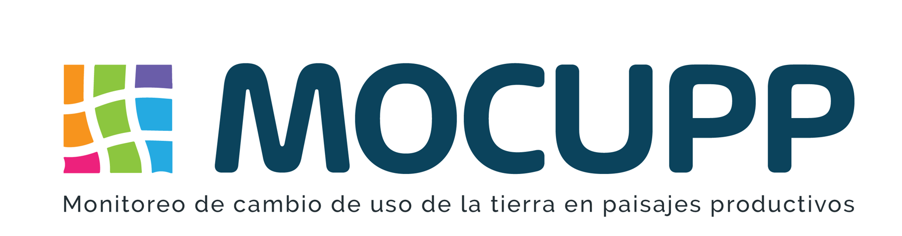

---
authors:
- admin
categories: []
date: "2019-02-05T00:00:00Z"
image:
  caption: ""
  focal_point: ""
lastMod: "2019-09-05T00:00:00Z"
projects: []
subtitle: Aprenderemos los pasos para generar el mapeo del MOCUPP-Urbano
summary: Aprenderemos los pasos para generar el mapeo del MOCUPP-Urbano
tags: []
title: Metodología MOCUPP-Urbano
---

## Procesos para el mapeo del MOCUPP Urbano

[MOCUPP](https://mocupp.org/) 
[Documento MOCUPP-Urbano](https://www.cr.undp.org/content/costarica/es/home/library/monitoreo-del-cambio-de-uso-y-cobertura-de-la-tierra-en-paisajes.html) 

1.Delimitación del área de trabajo área de trabajo
2. Selección de la imagen satelital
3. Procesamiento de la imagen satelital
4. Clasificación espectral de la imagen satelital 
5. Depuración de la clasificación espectral
6. Clasificación del mapeo de la trama verde
7. Validación del mapeo de trama verde
8. Publicación de la información

